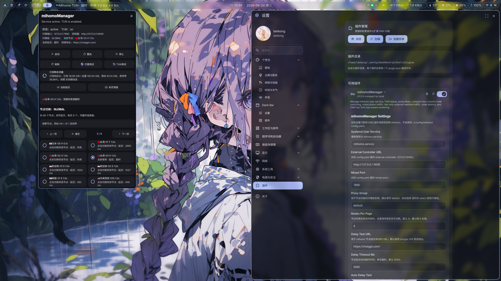

# mihomoManager

## 基础介绍

`mihomoManager` 是一个用于 Dank Material Shell（DMS）的 mihomo 管理插件。它用于在 DankBar 和 Control Center 中查看 mihomo 运行状态，并提供用户级服务控制、节点切换、延迟测试、订阅流量查看和 DankBar 实时外网速率显示等功能。

当前文档对应插件版本：`1.2.3`。

插件面向本机用户级 `mihomo.service`，默认读取 `http://127.0.0.1:9090` 上的 mihomo REST API。插件只读取 mihomo 状态并调用服务控制命令，不会主动改写 `~/.config/mihomo/config.yaml`。

## 插件预览



## 主要功能

- 在 DankBar 中显示 `mihomo.service` 的运行状态。
- 在 DankBar 中显示当前代理节点。
- 在 DankBar 中可选显示外网实时上行、下行速率。
- 检查 `mihomo` TUN 网卡是否存在，并显示 TUN 状态。
- 启动、停止、重启用户级 `mihomo.service`。
- 测试 mixed-port 代理连通性和 TUN 直连连通性。
- 读取 mihomo `external-controller` API。
- 显示当前代理组、当前节点和节点列表。
- 节点列表采用双列紧凑排布，适合屏幕高度有限的场景。
- 支持搜索节点、分页浏览节点。
- 支持切换 `select` 类型代理组中的节点。
- 支持读取 `subscription-userinfo` 订阅流量信息。
- 支持显示当前节点延迟，并可对当前节点或当前页节点测速。

## 依赖

- DMS / DankMaterialShell
- Quickshell
- `mihomo`
- `systemctl --user`
- `curl`
- `python3`
- `ip`
- 用户级服务名默认为 `mihomo.service`
- mihomo 配置中需要启用 `external-controller`

默认假设的 mihomo 配置：

```yaml
mixed-port: 7890
external-controller: 127.0.0.1:9090
tun:
  enable: true
  device: mihomo
```

如果你的 `external-controller`、`mixed-port`、TUN 设备名或用户级服务名不同，需要在插件设置页中改成自己的实际配置。

## 依赖安装说明

Arch Linux 参考：

```bash
sudo pacman -S mihomo curl python iproute2
```

确认用户级服务存在：

```bash
systemctl --user status mihomo.service
```

确认 mihomo API 可访问：

```bash
curl -s http://127.0.0.1:9090/proxies
```

确认 TUN 网卡：

```bash
ip link show mihomo
```

安装插件：

```bash
mkdir -p ~/.config/DankMaterialShell/plugins
cp -r mihomoManager ~/.config/DankMaterialShell/plugins/
dms ipc call plugins reload mihomoManager
```

如果热重载无效，重启 DMS：

```bash
dms restart
```

然后在 DMS Settings -> Plugins 中启用 `mihomoManager`，并把它添加到 DankBar 或 Control Center。

## 其他特殊说明

- 插件版本建议保持为 `1.2.3`，便于和当前修改后的插件内容对应。
- 插件只读取和控制 mihomo，不会主动改写 `~/.config/mihomo/config.yaml`。
- 插件目前不提供单独的 TUN 开关按钮。开启或关闭 TUN 需要修改 mihomo 配置中的 `tun.enable`，然后重启 `mihomo.service`。
- `Proxy Group` 应填写实际用于手动切换的 `select` 类型代理组名称，例如 `default`、`自动选择` 或你的自定义代理组。
- `url-test`、`fallback` 等代理组通常由 mihomo 自动管理，不适合手动切换。
- 当前节点延迟默认使用 `https://www.gstatic.com/generate_204` 测试，可在插件设置中修改。
- 订阅剩余流量来自 `subscription-userinfo` 响应头或配置文件开头注释，不是 mihomo 实时流量。
- DankBar 外网实时速率来自 mihomo `/connections`，会排除链路中包含 `DIRECT`、`REJECT`、`REJECT-DROP`、`PASS` 的连接。
- DankBar 外网实时速率只显示上行、下行速率，不显示外网活跃连接数量。
- 下拉面板中不显示独立的外网实时流量窗口，实时流量只在 DankBar 中按设置显示。
- 下拉面板中不包含打开 Mihomo 面板的模块。如果需要访问 Mihomo Dashboard，请自行在浏览器中打开对应地址。
- 外网实时速率是当前活跃连接的估算值，不等同于订阅用量。
- 如果订阅服务商没有返回 `subscription-userinfo`，插件会显示未读取到流量信息。

手动检查订阅流量响应头：

```bash
curl -fsSIL -A 'clash.meta' '你的订阅链接'
```

## 文件结构及作用

插件目录建议放在：

```text
~/.config/DankMaterialShell/plugins/mihomoManager/
```

目录结构：

```text
mihomoManager/
├── plugin.json
├── preview.png
├── MihomoManager.qml
├── MihomoManagerSettings.qml
└── README.md
```

各文件作用：

| 文件 | 作用 |
|---|---|
| `plugin.json` | DMS 插件清单，定义插件 ID、名称、版本、类型、入口组件、设置页、权限和兼容版本等信息。 |
| `preview.png` | 插件预览图，用于在 README 中展示插件实际效果。 |
| `MihomoManager.qml` | 插件主组件，负责 DankBar / Control Center 显示、服务控制、API 读取、节点切换、测速、订阅流量读取和 DankBar 外网实时速率显示。 |
| `MihomoManagerSettings.qml` | 插件设置页，提供服务名、API 地址、代理组、订阅链接、测速地址、节点显示数量和 DankBar 实时流量显示选项等设置。 |
| `README.md` | 插件说明文档。 |

## 运行时中间文件

`mihomoManager` 不创建独立的运行时临时文件。

插件运行时会通过 DMS / Quickshell 启动以下外部命令读取状态或执行操作：

| 命令 | 用途 |
|---|---|
| `systemctl --user` | 查询、启动、停止、重启 `mihomo.service`。 |
| `curl` | 请求 mihomo REST API、测速接口和订阅链接。 |
| `python3` | 处理批量测速、外网连接统计和订阅流量解析。 |
| `ip link show mihomo` | 检查 TUN 网卡状态。 |

插件设置由 DMS 插件系统保存，不在插件目录中生成额外配置文件。

## 插件删除（包括临时文件）

删除前建议先在 DMS Settings -> Plugins 中禁用 `mihomoManager`，或从 DankBar / Control Center 中移除该插件。

该插件不启动独立的长期后台进程，因此删除插件前不需要额外停止插件进程。是否停止 `mihomo.service` 取决于你是否还需要继续使用 mihomo。

删除插件目录：

```bash
rm -rf ~/.config/DankMaterialShell/plugins/mihomoManager
```

重新加载插件：

```bash
dms ipc call plugins reload mihomoManager
```

如果热重载无效，重启 DMS：

```bash
dms restart
```

该插件没有需要额外清理的独立临时文件。删除插件不会删除 mihomo 本身、`mihomo.service`、订阅配置或 `~/.config/mihomo/config.yaml`。
